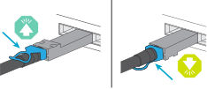

= Cabla l'hardware per il tuo sistema di archiviazione AFX 1K
:allow-uri-read: 
:icons: font
:imagesdir: ../media/

[role="lead"]
Dopo aver installato l'hardware del rack per il sistema di archiviazione AFX 1K, installare i cavi di rete per i controller e collegare i cavi tra i controller e gli scaffali di archiviazione.

.Prima di iniziare
Per informazioni su come collegare il sistema di archiviazione agli switch di rete, contattare l'amministratore di rete.

.Informazioni su questo compito
* Queste procedure mostrano configurazioni comuni.  Il cablaggio specifico dipende dai componenti ordinati per il sistema di storage.  Per dettagli completi sulla configurazione e sulle priorità degli slot, vederelink:https://hwu.netapp.com["Hardware Universe NetApp"^] .
* Gli slot I/O su un controller AFX sono numerati da 1 a 11.
+
image::../media/drw_a1K_back_slots_labeled_ieops-2162.svg[Numerazione degli slot su un controller AFX]

* La grafica del cablaggio mostra delle icone a forma di freccia che indicano il corretto orientamento (verso l'alto o verso il basso) della linguetta di estrazione del connettore del cavo quando si inserisce un connettore in una porta.
+
Quando inserisci il connettore, dovresti sentire uno scatto; se non lo senti, rimuovilo, giralo e riprova.

+

+
[NOTE]
====
I componenti del connettore sono delicati e occorre fare attenzione quando si agganciano in posizione.

====
* Quando si esegue il cablaggio verso una connessione in fibra ottica, inserire il transceiver ottico nella porta del controller prima di collegare il cavo alla porta dello switch.
* Il sistema di storage AFX 1K utilizza 4 cavi breakout da 100 GbE sul cluster e sulla rete di storage.  Le connessioni 400GbE vengono effettuate sulle porte dello switch, mentre le connessioni 100GbE vengono effettuate sulle porte del controller e dello scaffale dell'unità.  Le connessioni di storage e HA/Cluster possono essere effettuate su qualsiasi porta non ISL dello switch.
+
Per una determinata connessione tramite cavo breakout 4x100GbE alla porta switch specifica, si collegano tutte e 4 le porte che vanno allo switch tramite questo singolo cavo breakout.

+
** 1 porta HA (slot 1)
** 1 porta cluster (slot 7)
** 2 porte di archiviazione (slot 10, 11)
+
Tutte le porte 'a' si collegano allo switch A e tutte le porte 'b' si collegano allo switch B.

NOTE: Le configurazioni degli switch Cisco Nexus 9332D-GX2B e 9364D-GX2A per il sistema di storage AFX 1K richiedono connessioni tramite cavi breakout 4x100GbE.

== Fase 1: collegare i controller alla rete di gestione

Collegare la porta di gestione su ogni switch a uno degli switch di gestione (se ordinati) oppure collegarli direttamente alla rete di gestione.

La porta di gestione è la porta in alto a destra situata sul lato PSU dello switch.  Dopo l'installazione degli switch, il cavo CAT6 di ogni switch deve essere instradato attraverso il pannello passante per connettersi agli switch di gestione o alla rete di gestione.

Utilizzare i cavi RJ-45 1000BASE-T per collegare le porte di gestione (chiave inglese) su ciascun controller agli switch di rete di gestione.

image::../media/oie_cable_rj45.png[cavi RJ-45]

*Cavi RJ-45 1000BASE-T*

image::../media/drw_afx_management_connection_ieops-2349.svg[Connettiti alla tua rete di gestione]

IMPORTANT: Non collegare ancora i cavi di alimentazione.

. Connettiti alla rete host.

== Passaggio 2: collegare i controller alla rete host

Collegare le porte del modulo Ethernet alla rete host.

Questa procedura può variare a seconda della configurazione del modulo I/O.  Di seguito sono riportati alcuni esempi tipici di cablaggio di rete host.  Vederelink:https://hwu.netapp.com["Hardware Universe NetApp"^] per la configurazione specifica del tuo sistema.

.Passi
. Collegare le seguenti porte allo switch di rete dati Ethernet A.
+
** Controller A (esempio)
+
*** e2a
*** e3a

** Controller B (esempio)
+
*** e2a
*** e3a
+
*Cavi da 100 GbE*

+
image::../media/oie_cable100_gbe_qsfp28.png[Cavo Ethernet da 100 Gb]

+
image::../media/drw_afx_network_cabling_a_ieops-2350.svg[Cavo alla rete Ethernet]

. Collegare le seguenti porte allo switch di rete dati Ethernet B.
+
** Controller A (esempio)
+
*** e2b
*** e3b

** Controller B (esempio)
+
*** e2b
*** e3b
+
*Cavi da 100 GbE*

+
image::../media/oie_cable100_gbe_qsfp28.png[Cavo Ethernet da 100 Gb]

+
image::../media/drw_afx_network_cabling_b_ieops-2351.svg[Cavo alla rete Ethernet]

== Passaggio 3: Cablare il cluster e le connessioni HA

Utilizzare il cavo di interconnessione Cluster e HA per collegare le porte e1a ed e7a allo switch A e e1b ed e7b allo switch B. Le porte e1a/e1b vengono utilizzate per le connessioni HA, mentre le porte e7a/e7b vengono utilizzate per le connessioni cluster.

.Passi
. Collegare le seguenti porte del controller a qualsiasi porta non ISL sullo switch di rete del cluster A.
+
** Controllore A
+
*** e1a
*** e7a

** Controllore B
+
*** e1a
*** e7a
+
*Cavi da 100 GbE*

+
image::../media/oie_cable_25Gb_Ethernet_SFP28_ieops-1069.png[Cavo Cluster HA]

+
image::../media/drw_afx_switched_cluster_cabling_a_ieops-2352.svg[Collegamenti del cluster via cavo alla rete del cluster]

. Collegare le seguenti porte del controller a qualsiasi porta non ISL sullo switch di rete del cluster B.
+
** Controllore A
+
*** e1b
*** e7b

** Controllore B
+
*** e1b
*** e7b
+
*Cavi da 100 GbE*

+
image::../media/oie_cable_25Gb_Ethernet_SFP28_ieops-1069.png[Cavo Cluster HA]

+
image::../media/drw_afx_switched_cluster_cabling_b_ieops-2353.svg[Collegamenti del cluster via cavo alla rete del cluster]

== Passaggio 4: cablare le connessioni di archiviazione dal controller allo switch

Collegare le porte di archiviazione del controller agli switch.  Assicurati di avere i cavi e i connettori corretti per i tuoi switch. Vedere https://hwu.netapp.com["Hardware Universe"^] per maggiori informazioni.

. Collegare le seguenti porte di archiviazione a qualsiasi porta non ISL sullo switch A.
+
** Controllore A
+
*** e10a
*** e11a

** Controllore B
+
*** e10a
*** e11a
+
*Cavi da 100 GbE*

+
image::../media/oie_cable100_gbe_qsfp28.png[Cavo da 100 Gb]

+
image::../media/drw_afx_controller_storage_cable_a_ieops-2354.svg[Cavo di archiviazione del controller per commutare A]

. Collegare le seguenti porte di archiviazione a qualsiasi porta non ISL sullo switch B.
+
** Controllore A
+
*** e10b
*** e11b

** Controllore B
+
*** e10b
*** e11b
+
*Cavi da 100 GbE*

+
image::../media/oie_cable100_gbe_qsfp28.png[Cavo da 100 Gb]

+
image::../media/drw_afx_controller_storage_cable_b_ieops-2355.svg[Cavo di archiviazione del controller per switch B]

== Fase 5: Cablare i collegamenti tra scaffale e switch

Collegare gli scaffali portaoggetti NX224 agli switch.

Per il numero massimo di ripiani supportati dal tuo sistema di archiviazione e per tutte le opzioni di cablaggio, consultalink:https://hwu.netapp.com["Hardware Universe NetApp"^] .

. Collegare le seguenti porte shelf a qualsiasi porta non ISL sullo switch A e sullo switch B per il modulo A.
+
** Modulo A per commutare le connessioni A
+
*** e1a
*** e2a
*** e3a
*** e4a

** Modulo A per commutare le connessioni B
+
*** e1b
*** e2b
*** e3b
*** e4b
+
*Cavi da 100 GbE*

+
image::../media/oie_cable100_gbe_qsfp28.png[Cavo da 100 Gb]

+
image::../media/drw_afx_shelf_cabling_a_ieops-2356.svg[Mensola portacavi per interruttore A e interruttore B]

. Collegare le seguenti porte shelf a qualsiasi porta non ISL sullo switch A e sullo switch B per il modulo B.
+
** Modulo B per commutare le connessioni A
+
*** e1a
*** e2a
*** e3a
*** e4a

** Modulo B per commutare le connessioni B
+
*** e1b
*** e2b
*** e3b
*** e4b
+
*Cavi da 100 GbE*

+
image::../media/oie_cable100_gbe_qsfp28.png[Cavo da 100 Gb]

+
image::../media/drw_afx_shelf_cabling_b_ieops-2357.svg[Mensola portacavi per interruttore A e interruttore B]

.Cosa succederà ora?
Dopo aver cablato l'hardware,link:power-on-configure-switch.html["accendere e configurare gli switch"] .
