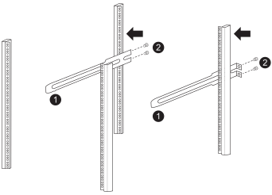

= Installa gli switch per il tuo sistema di archiviazione AFX 1K
:allow-uri-read: 
:icons: font
:imagesdir: ../media/

[role="lead"]
Dopo aver completato la preparazione per l'installazione del sistema di archiviazione AFX 1K, è necessario installare gli switch nell'armadio o nel rack Telco.

Installare gli switch Cisco Nexus 9332D-GX2B o 9364D-GX2A nell'armadio o nel rack.  Se si utilizza lo switch Cisco Nexus 9364D-GX2A, installare un kit pannello passante.

.Prima di iniziare
Assicurati di avere a disposizione i seguenti componenti:

* Il kit del pannello passante è disponibile presso NetApp (codice articolo X8784-R6).
+
Il kit del pannello pass-through NetApp contiene il seguente hardware:

+
** Un pannello cieco passante
** Quattro viti 10-32 x .75
** Quattro dadi a clip 10-32

* Per ogni switch, otto viti 10-32 o 12-24 e dadi a clip per montare le staffe e le guide scorrevoli sui montanti anteriori e posteriori del mobile.
* Kit di guide standard Cisco per installare lo switch in un cabinet NetApp .

NOTE: I cavi di collegamento non sono inclusi nel kit passante.  Contattare NetApp per ordinare i cavi jumper corretti se non vengono forniti con gli switch.

NOTE: Cisco 9332D-GX2B e 9364D-GX2A sono switch di aspirazione lato porta.  Le porte di rete per gli switch devono essere installate rivolte verso la parte anteriore del cabinet, mentre le ventole di scarico devono essere rivolte verso la parte posteriore del cabinet.  Con questa configurazione, è necessario assicurarsi di utilizzare cavi sufficientemente lunghi da collegare le porte di rete nella parte anteriore del cabinet alle porte di archiviazione nella parte posteriore del cabinet.  + Per informazioni più dettagliate su questi switch, visitare il sito Web Cisco : https://www.cisco.com/c/en/us/td/docs/dcn/hw/nx-os/nexus9000/9332d-gx2b/cisco-nexus-9332d-gx2b-nx-os-mode-switch-hardware-installation-guide.html["Guida all'installazione hardware dello switch Cisco Nexus 9332D-GX2B NX-OS Mode"^] E https://www.cisco.com/c/en/us/td/docs/dcn/hw/nx-os/nexus9000/9364d-gx2a/cisco-nexus-9364d-gx2a-nx-os-mode-switch-hardware-installation-guide.html["Guida all'installazione hardware dello switch Cisco Nexus 9364D-GX2A NX-OS Mode"^] .

.Passi
. Installare il pannello cieco passante.
+
.. Determinare la posizione verticale degli switch e del pannello cieco nell'armadio o nel rack.
.. Installare due dadi a clip su ciascun lato nei fori quadrati appropriati per le guide anteriori del mobile.
.. Centrare il pannello verticalmente per evitare intrusioni nello spazio rack adiacente, quindi serrare le viti.
.. Inserire i connettori femmina di entrambi i cavi di collegamento dalla parte posteriore del pannello e attraverso il gruppo spazzole.
+
image::../media/cisco_9148_jumper_cords.gif[Connettori femmina del cavo di collegamento]

+
[cols="1,4"]
|===

 a| 
image::../media/icon_round_1.png[Numero di chiamata 1]
 a| 
Connettore femmina del cavo di collegamento.

|===

. Installare le staffe di montaggio su rack sullo chassis dello switch.
+
.. Posizionare una staffa di montaggio su rack anteriore su un lato del telaio dello switch in modo che l'aletta di montaggio sia allineata con la piastra frontale del telaio (sul lato dell'alimentatore o della ventola), quindi utilizzare quattro viti M4 per fissare la staffa al telaio.
+
image::../media/3132q_front_bracket.gif[staffa anteriore]

.. Ripetere il passaggio 2a con l'altra staffa di montaggio su rack anteriore sull'altro lato dello switch.
.. Installare la staffa di montaggio posteriore sul telaio dello switch.
.. Ripetere il passaggio 2c con l'altra staffa di montaggio su rack posteriore sull'altro lato dello switch.

. Installare i dadi a clip nelle posizioni dei fori quadrati per tutti e quattro i pali IEA.
+
image::../media/ru_locations_for_3132q_v.gif[Posizioni dei dadi a clip]

+
Montare i due switch 9332D-GX2B in posizioni dell'armadio che consentano un accesso efficiente ai controller e agli scaffali, come le file centrali.

. Installare le guide scorrevoli nell'armadio o nel rack.
+
.. Posizionare la prima guida scorrevole nella posizione desiderata sul lato posteriore del montante posteriore sinistro, inserire le viti con il tipo di filettatura corrispondente e quindi serrare le viti con le dita.
+

+
[cols="1,4"]
|===

 a| 
image::../media/icon_round_1.png[Numero di chiamata 1]
 a| 
Mentre fai scorrere delicatamente la guida scorrevole, allineala ai fori delle viti nel rack.

 a| 
image::../media/icon_round_2.png[Numero di chiamata 2]
 a| 
Stringere le viti delle guide scorrevoli ai montanti del mobile.

|===
.. Ripetere il passaggio 4a per il montante posteriore destro.
.. Ripetere i passaggi 4a e 4b nei punti desiderati del mobile.

. Installare l'interruttore nell'armadio o nel rack.
+

NOTE: Per questa operazione sono necessarie due persone: una persona sostiene l'interruttore dalla parte anteriore e un'altra lo guida nelle guide scorrevoli posteriori.

+
.. Posizionare la parte posteriore dell'interruttore nella posizione desiderata sul mobile.
+
image::../media/drw_switch_cabinet_position_generic_ieops-2348.svg[Posizionamento 3232C a U39-40]

+
[cols="1,4"]
|===

 a| 
image::../media/icon_round_1.png[Numero di chiamata 1]
 a| 
Mentre il telaio viene spinto verso i montanti posteriori, allineare le due guide di montaggio del rack posteriore con le guide scorrevoli

 a| 
image::../media/icon_round_2.png[Numero di chiamata 2]
 a| 
Far scorrere delicatamente l'interruttore finché le staffe di montaggio sul rack anteriore non siano a filo con i montanti anteriori.

|===
.. Fissare l'interruttore all'armadio o al rack.
+
image::../media/3132q_attaching.gif[Attacco interruttore]

+
[cols="1,4"]
|===

 a| 
image::../media/icon_round_1.png[Numero di chiamata 1]
 a| 
Mentre una persona tiene in piano la parte anteriore del telaio, l'altra persona deve stringere completamente le quattro viti posteriori ai montanti del mobile.

|===
.. Ora che il telaio è supportato senza assistenza, serrare completamente le viti anteriori ai montanti.
.. Ripetere i passaggi da 5a a 5c per il secondo interruttore nella posizione desiderata sull'armadio.
+

NOTE: Utilizzando come supporto l'interruttore completamente installato, non è necessario tenere ferma la parte anteriore del secondo interruttore durante il processo di installazione.

. Una volta installati gli interruttori, collegare i cavi di collegamento alle prese di alimentazione degli interruttori.
. Collegare le spine maschio di entrambi i cavi di collegamento alle prese PDU più vicine disponibili.
+

NOTE: Per mantenere la ridondanza, i due cavi devono essere collegati a PDU diverse.

. Collegare la porta di gestione su ogni switch a uno degli switch di gestione (se ordinati) oppure collegarli direttamente alla rete di gestione.
+
La porta di rete di gestione è la porta RJ-45 inferiore vicino all'alimentatore destro.  Dopo aver installato gli switch, far passare il cavo CAT6 per ogni switch attraverso il pannello passante per collegarli agli switch di gestione o alla rete.

.Cosa succederà ora?
Dopo aver installato gli switch nell'armadio o nel rack, è possibilelink:deploy-hardware.html["installare il sistema di archiviazione AFX 1K e i ripiani nell'armadio o nel rack"] .
